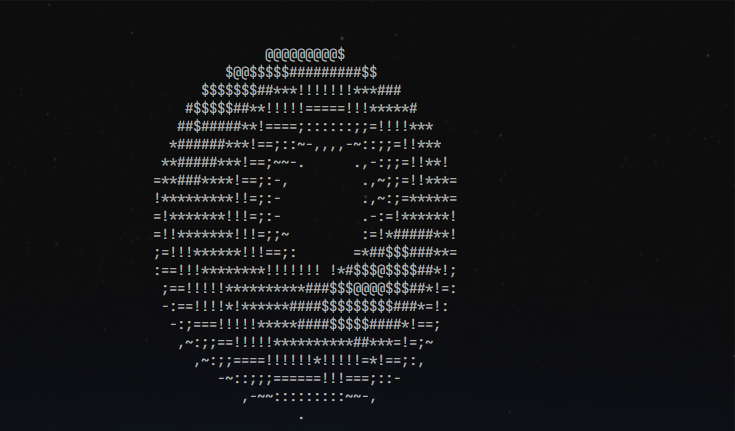

# K-A-D-E-R-S

> Learning C++ by building small things that are fun.

I'm currently learning C++, and instead of following tutorials endlessly, I'm creating small projects, experiments, and terminal trinkets along the way.

This repository is a collection of those builds—some useful, some weird, all part of the learning process.

## What's Here?

- Small C++ projects
- Graphics and terminal experiments
- Practice implementations
- Random ideas that seemed interesting enough to build

## Goal

Write code consistently, learn by making mistakes, and enjoy the process.

---
